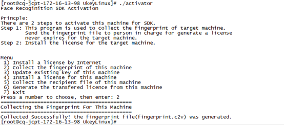
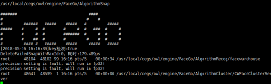
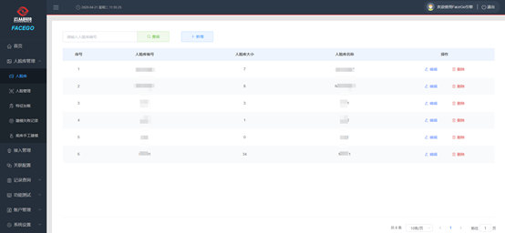
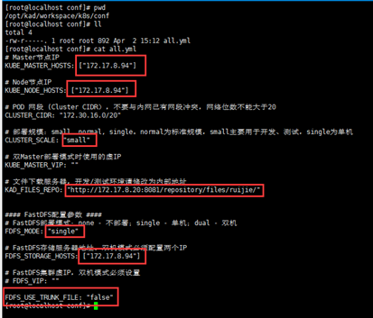
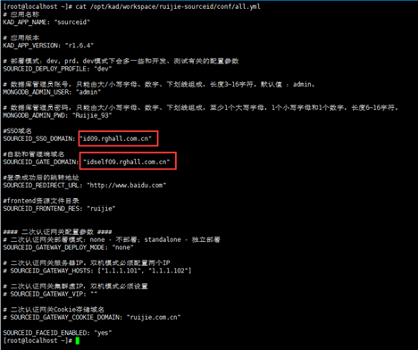
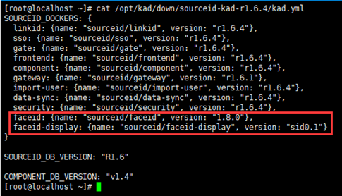
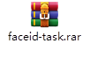
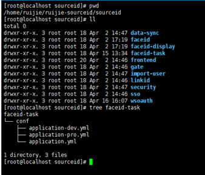
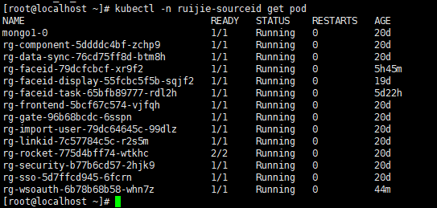

# **SourceID**人脸环境部署

## 前言

### 概述

本文主要书写SourceID产品人脸部分及相关依赖在进行安装部署时，如何进行安装部署，将相关的步骤进行描述说明。

SourceID产品具体安装详见：svn://192.168.54.191/ykt/RG_LinkID项目管理/SID业务学习文档/部署实施/高教方案/BS-00-SourceId1.6.4版本安装部署手册.docx。

 

### 修订记录

| **日期**       | **版本** | **修订说明** | **作者** |
| -------------- | -------- | ------------ | -------- |
| 2020年04月26日 | V1.0     | 第一次发布   | 陆勇思   |
|                |          |              | <br>     |

   

> **注：集群部署模式中所有操作均在Master主节点服务器上执行，单机部署就直接在服务器上执行，服务器登录账号只能用root账号操作，集群模式下master主节点与node节点服务器的密码要保持一致。**


## 一、  资源准备

### 1、 硬件资源：

| 服务器节点 | 服务器系统版本   | 网络    | CPU核数 | 内存容量 | 硬盘磁盘容量          | 说明                                             |
| ---------- | ---------------- | ------- | ------- | -------- | --------------------- | ------------------------------------------------ |
| 服务器A    | CentOS  7.6.1810 | 与C互通 | 16核    | 32G      | 系统盘50G，数据盘500G | 必须安装有英伟达显卡，用于安装人脸厂商服务器     |
| 服务器B    | CentOS  7.6.1810 | 与C互通 | 16核    | 32G      | 系统盘50G，数据盘500G | 作为FastDFS服务器                                |
| 服务器C    | CentOS  7.6.1810 | 与B互通 | 16核    | 32G      | 系统盘50G，数据盘500G | 一到多台，部署SourceID以及人脸组件，根据时间需要 |

### 2、 软件资源：

- Centos7系统、英伟达显卡驱动、云从服务端软件、KAD部署包、FaceId-Task镜像。

- SecureCRT或Xshell、winscp等远程工具。


### 3、 外部资源：

云从license。

 

## 二、  总体顺序

1、 云从服务器安装系统以及显卡驱动，收集机器码。

2、 云从官网申请license。

3、 服务器安装license，启动云从服务端。

4、 作为FastDFS的服务器安装操作系统，通过KAD部署FastDFS组件。

5、 用于部署SourceID的服务器安装好操作系统后，通过KAD部署SourceID服务。

6、 部署FaceId-Task组件。

## 三、  部署CloudCore_FaceEngine服务（云从）

### 1、 准备服务器

服务器需要安装有英伟达显卡，适用系统： centos7.2、centos7.3。

### 2、 安装显卡驱动

#### 2.1、按照步骤

##### 2.1.1、 检查BIOS中的Secure Boot设置，将该值设置成disable

##### 2.1.2、 查看显卡型号

```shell
lspci | grep -i vga
lspci -v -s 83:00.0
```

 

##### 2.1.3、 官网上搜索并下载对应驱动https://www.geforce.cn/drivers

 

##### 2.1.4、 将下载的驱动上传到服务器

```shell
## 通过winscp等工具或者lrzsz命令
mkdir /opt/cloudCore
cd /opt/cloudCore
yum install lrzsz
rz
## 然后选择文件
```

##### 2.1.5、 安装gcc

```shell
yum -y install gcc
```

##### 2.1.6、 安装kernel-devel

```shell
##查看当前内核版本号
uname -r 

## 访问http://rpm.pbone.net/index.php3，查找内核版本对应的kernel-devel包
wget ftp://ftp.pbone.net/mirror/dl.central.org/dl/linuxdev/centos7/x86_64/kernel-devel-3.10.0-957.el7.x86_64.rpm

## 需要先安装perl工具
yum install perl
rpm -ivh kernel-devel-2.6.32-431.el6.x86_64.rpm
```


  

##### 2.1.7、 安装dkms

```shell
yum -y install dkms

## 如果这一步提示没有对应的包，可以通过以下方法安装：

yum install perl*

perl -v

yum install epel-release

yum --enablerepo=epel install dkms
```

##### 2.1.8、 关闭图形界面并重启

```shell
sudo service lightdm stop
## 重启：
reboot
```

##### 2.1.9、 安装驱动

```shell
## 进入到驱动存放的路径
./NVIDIA-Linux-x86_64-440.64.run --kernel-source-path=/usr/src/kernels/3.10.0-1062.18.1.el7.x86_64 -k $(uname -r) -dkms

## /usr/src/kernels/3.10.0-1062.18.1.el7.x86_64为kernel安装后的地址，根据自己的版本确定
## 选项基本选择默认，其中覆盖安装选择覆盖
```

 

##### 2.1.10、     重启图形界面（可选）

```shell
sudo service lightdm start

## 重启
reboot
```

 

##### 2.1.11、检查是否安装完成，执行命令后出现以下内容说明安装完成

```shell
nvidia-smi
```

  

 

#### 2.2 常见问题：

##### 2.2.1、 Unable to load the 'nvidia-drm' kernel module

未安装dkms，执行上方步骤6

检查BIOS中的Secure Boot设置，该值需要设置成disable

 

##### 2.2.2、 kernel版本和内核版本不一致导致

```shell
Failed to run `/usr/sbin/dkms build -m nvidia -v 440.64 -k 3.10.0-957.el7.x86_64`: Error! Echo Your kernel headers for kernel 3.10.0-957.el7.x86_64 cannot be found at /lib/modules/3.10.0-957.el7.x86_64/build or /lib/modules/3.10.0-957.el7.x86_64/source. You can use the --kernelsourcedir option to tell DKMS where it's located.
```

解决方案：

```shell
yum install “kernel-devel-uname-r == $(uname -r)”

## 安装kernel时使用上方的命令，当yum源中没有对应版本的时候，会导致安装的版本不匹配，此时可以先卸载，再参照上方步骤5重新安装，卸载命令：

yum remove kernel-devel-版本号
```


 

### 3、 收集机器码，申请license

#### 3.1、 收集机器码

```shell
cd /opt/cloudCore

## 选择文件
rz 

## 解压Linux激活工具
tar xzvf User_UkeyLinux_v1.8.tar.gz

## 进入目录
cd UkeyLinux

## 执行./activator，输入2，收集机器码。
./activator
```

 <a href="deployment.assets/User_UkeyLinux_v1.8.tar.gz">文件下载</a>


 

#### 3.2、生成v2c文件

登陆授权官网：https://ai.cloudwalk.cn

fingerprint.c2v文件样例：

 

将fingerprint.c2v文件内的全部内容复制，粘贴至“请输入设备ID号”处，然后点击“确认”，平台会生成v2c.txt文件。


  

#### 3.3、 激活授权

```shell
cd /opt/cloudCore/UkeyLinux

rz   ##选择文件

./activator
```

下载v2c文件，得到v2c.txt文件，上传至云从服务器。


云从服务器主机，执行./activator，输入4，输入v2c.txt，即可完成授权激活。

 

#### 3.4、检查授权状态

执行./UkeyCheck，检查授权状态，核对申请的授权是否正确。

 

### 4、 启动云从服务端

（1）关闭防火墙

```shell
##服务运行需要将防火墙关闭，如果需要永久关闭可执行如下两条命令，执行信息。

systemctl stop firewalld ##临时关闭防火 安装程序默认 

systemctl disable firewalld ##永久关闭防火墙
```


 

（2）安装包准备

将 CloudCore_FaceEngine 安装程序拷贝至/home/（用户）目录，目录可任意指定。

登录服务器并cd进入目录。

首先解压 CloudCore_FaceEngine.tar.gz 引擎安装包。 

执行命令：tar xzvf FaceGo.tar.gz。

解压后修改文件权限：chmod 777 *。

 

（3）该目录下的文件需要修改：

/{filepath}/FaceGo/AlgorithmRecog/config/extra_conf_gpu.txt

GpuID：GPU个数-1，一个GPU配0，两个GPU配1。

nDetectThread=3： #人脸检测线程数，GPU个数*3。

nFeatureThread=1： #特征提取线程数，GPU个数*1。


Tip：只需要修改extra_conf_gpu.txt一个文件。

（4）启动

在主程序目录下执行./start.sh，出现如下标识说明启动成功。



（5）登录页面

地址：ip:7100/page；用户名/密码：admin/admin。登录成功后配置需要使用的人脸库，此人脸库名称会在后面人脸组件上对应配置。

 

## 四、  KAD部署FastDFS

### 1、 KAD工具安装

（1）在线安装

```shell
yum install -y http://172.17.8.20:8081/repository/files/ruijie/kad/release/kad-1.6.0-1.x86_64.rpm

## 具体版本根据实际情况确定
```

（2）离线安装

```shell
##将KAD安装包复制到/opt目录下

cd /opt

tar xzvf sourceid-kad-r1.6.4.tar.gz -C /opt/kad
```


### 2、 修改配置文件

/opt/kad/workspace/k8s/conf/all.yml中的FastDFS配置参数。

新增：FDFS_USE_TRUNK_FILE: "false"，防止出现图片获取不到的情况。




### 3、 执行部署

```shell
kad-play playbooks/fdfs/setup.yml
```


### 4、 查看部署状态

```shell
ps -aux |grep fdfs_storaged

ps -aux |grep fdfs_trackerd


## 查看fdfs_storaged，fdfs_trackerd两个服务状态

systemctl status fdfs_storaged

systemctl status fdfs_trackerd
```


### 5、 卸载（可选）

如果需要卸载，执行以下命令。

kad-play playbooks/fdfs/clean.yml

如果kad工具无法卸载，可以使用网上的方式进行卸载。

链接地址：[https://blog.csdn.net/weixin_37380784/article/details/94732272](https://blog.csdn.net/weixin_37380784/article/details/94732272)


## 五、  KAD部署SourceID

### 1、 KAD工具安装

```shell
yum install -y http://172.17.8.20:8081/repository/files/ruijie/kad/release/kad-1.6.0-1.x86_64.rpm

#### 具体版本根据实际情况确定
```


### 2、 修改配置文件

（1）在/opt/kad/workspace/ruijie-sourceid/conf/all.yml文件添加人脸组件：

SOURCEID_FACEID_ENABLED: "yes"

配置域名

 

（2）kad.yml添加人脸组件及版本号：

版本号根据实际情况修改

/opt/kad/down/sourceid-kad-r1.6.4/kad.yml

faceid: {name: "sourceid/faceid", version: "1.8.0R1"},

faceid-display: {name: "sourceid/faceid-display", version: "sid0.1"},

 

### 3、 修改配置文件

人脸组件版本可能需要安装最新版，而kad工具打包时只打包了当时的配置文件和数据库脚本，因此需要手工修改配置文件。

/opt/kad/workspace/ruijie-sourceid/conf/sourceid/faceid/application-pro.yml

修改该文件的ycface配置，包括云从地址以及云从上配置的人脸库groupIds

### 4、 部署SourceID

```shell
kad-play playbooks/sourceid/prepare.yml

kad-play playbooks/sourceid/setup.yml
```

### 5、 检测状态

```shell
kubectl -n ruijie-sourceid get pod
```


## 六、  手工部署faceId-task和wsoauth

### 1、 准备yml文件

> 注意根据服务器情况合理分配cpu内存等，faceid-task项目只能单pod部署

**wsoauth.yml**    <a href="deployment.assets/wsoauth.yml">下载文件</a>

```yaml
apiVersion: extensions/v1beta1
kind: Deployment
metadata:
  name: rg-wsoauth
  namespace: ruijie-sourceid
spec:
  replicas: 1
  template:
    metadata:
      labels:
        service: rg-wsoauth
    spec:
      containers:
      - name: rg-wsoauth
        image: id.ruijie.com.cn:25082/sourceid/wsoauth:1.8.0p10
        imagePullPolicy: IfNotPresent
        env:
        - name: JAVA_OPT_EXT
          value: "-Xms1024m -Xmx1024m"
        resources:
          limits:
           cpu: 1
           memory: 1Gi
          requests:
           cpu: 1
           memory: 1Gi

        ports:
        - containerPort: 8580
        volumeMounts:
        - mountPath: /ruijie/sourceid/wsoauth/conf
          name: conf
      imagePullSecrets:
      - name: regsecret
      volumes:
        - name: conf
          hostPath:
            path: /home/ruijie/ruijie-sourceid/sourceid/wsoauth/conf

---
apiVersion: v1
kind: Service
metadata:
  name: rg-wsoauth
  namespace: ruijie-sourceid
spec:
  selector:
    service: rg-wsoauth
  ports:
  - port: 80
    targetPort: 8580

---
apiVersion: extensions/v1beta1
kind: Ingress
metadata:
  name: rg-wsoath-ingress
  namespace: ruijie-sourceid
spec:
  rules:
  - host: self.wzu.edu.cn
    http:
      paths:
      - path: /wsoauth
        backend:
          serviceName: rg-wsoauth
          servicePort: 80

```


**faceid-task.yml **<a href="deployment.assets/faceid-task.yml">下载文件</a>

```yaml
apiVersion: extensions/v1beta1
kind: Deployment
metadata:
  name: rg-faceid-task
  namespace: ruijie-sourceid
spec:
  replicas: 1
  template:
    metadata:
      labels:
        service: rg-faceid-task
    spec:
      containers:
      - name: rg-faceid-task
        image: id.ruijie.com.cn:25082/sourceid/faceid-task:1.8.0
        imagePullPolicy: IfNotPresent
        env:
        - name: JAVA_OPT_EXT
          value: "-Xms512m -Xmx2048m"
        resources:
          limits:
           cpu: 2
           memory: 3Gi
          requests:
           cpu: 1
           memory: 2Gi

        ports:
        - containerPort: 8903
        volumeMounts:
        - mountPath: /ruijie/sourceid/faceid-task/conf
          name: conf
      imagePullSecrets:
      - name: regsecret
      volumes:
        - name: conf
          hostPath:
            path: /home/ruijie/ruijie-sourceid/sourceid/faceid-task/conf

---
apiVersion: v1
kind: Service
metadata:
  name: rg-faceid-task
  namespace: ruijie-sourceid
spec:
  selector:
    service: rg-faceid-task
  ports:
  - port: 80
    targetPort: 8903

```

### 2、 新增配置文件

目前配置文件放在/home/ruijie/ruijie-sourceid/sourceid 路径下，如果没有配置文件，镜像启动时会异常。

Tip：如果k8s集群有多台，则每台机器上都需要配置，配置文件需要手工修改数据库链接等配置。

<a href="deployment.assets/faceid-task.rar">下载文件</a>

 

### 3、 修改配置

rg.sync.image：任务运行间隔时间

identity.user-id：从linkid获取的用户id的key

identity.client-id：支持人脸同步的client

identity.get-users：获取用户id的接口

 

### 4、 部署应用

```shell
## 通过yml文件创建pod

kubectl create -f /opt/kad/workspace/ruijie-sourceid/yaml/faceid-task/faceid-task.yml

kubectl create -f /opt/kad/workspace/ruijie-sourceid/yaml/wsoauth/wsoauth.yml
```


### 5、 检测状态

```shell
kubectl -n ruijie-sourceid get pod
```

