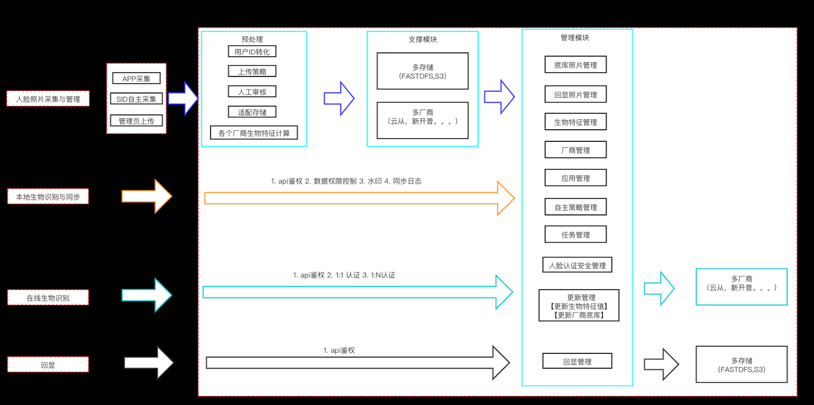
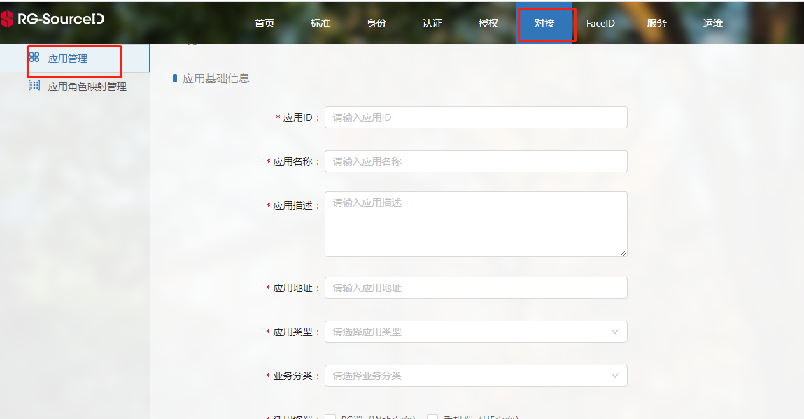
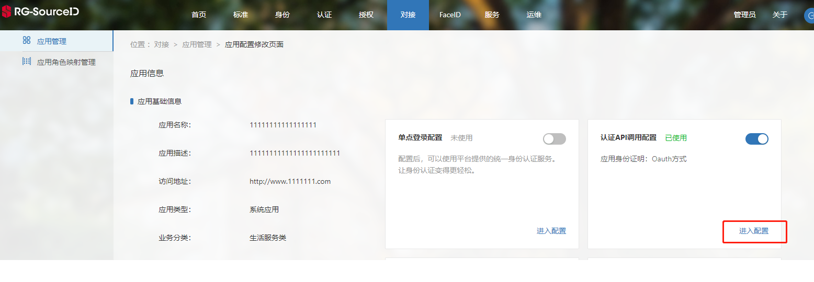
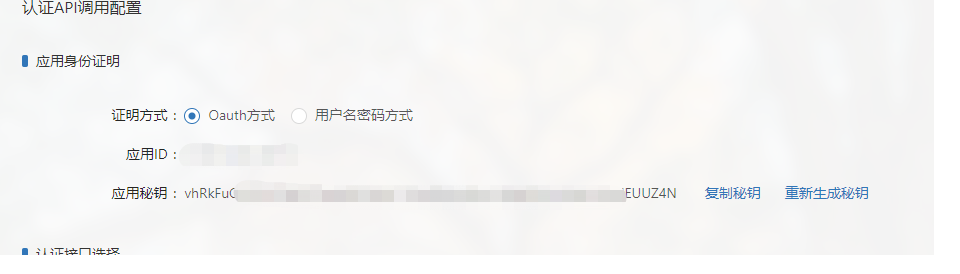
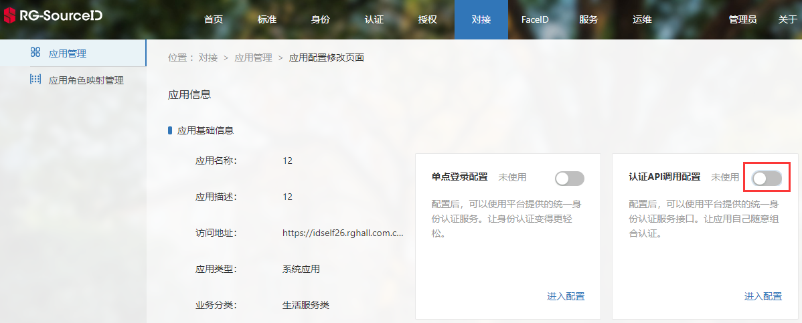
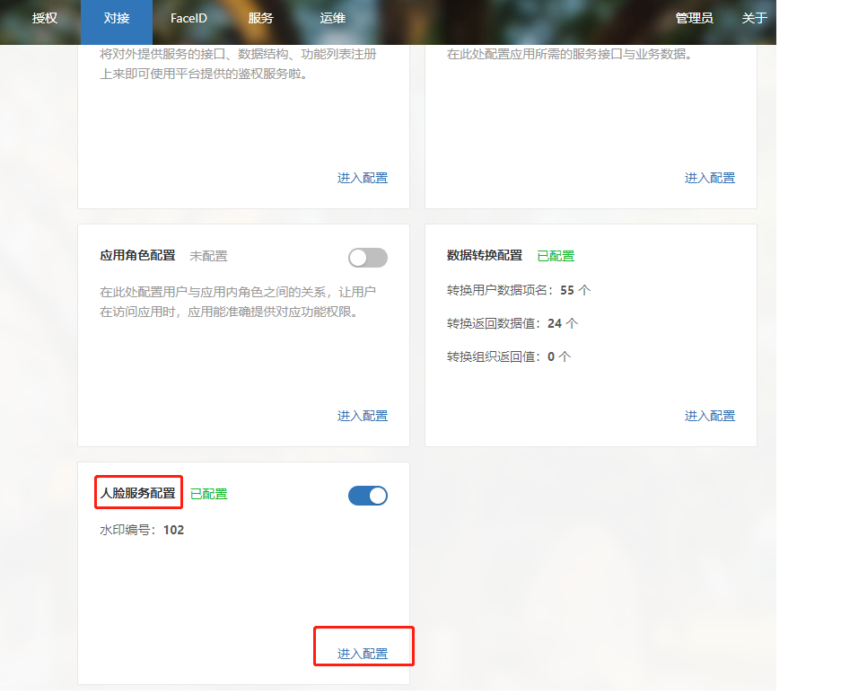
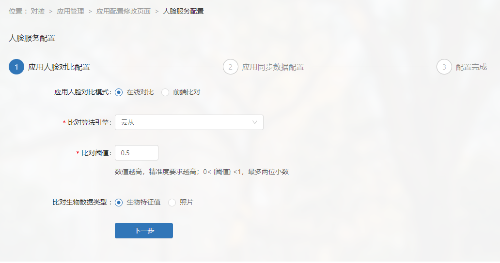
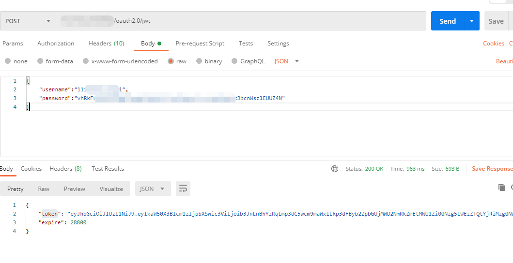
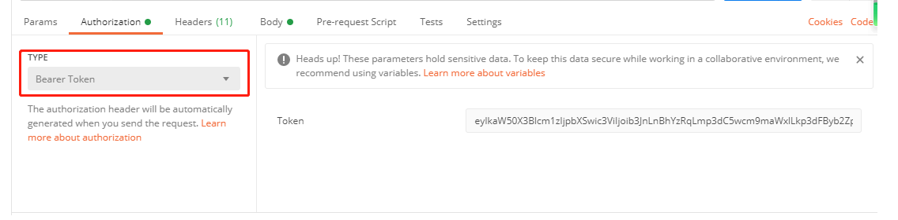

# 开发前须知
>[人脸概念](#link1)
>
>[人脸业务总体架构](#link2)
>
>[多厂商、多应用对接技术说明](#link3)
>
>[人脸对外服务应用对接步骤](#link4)

#### 人脸概念

SourceID（简称SID）人脸提供统一标准进行用户照片采集和入库，以及照片管理。基于入库照片对接多家厂商或应用，实现人脸认证等功能，并对外提供认证、同步接口服务以供应用调用。

#### 人脸业务总体架构

如上图，SID主要提供3部分功能：

**人脸库管理：**采集和管理用户照片等信息。

**多厂商、多应用对接：**SID对接多厂商或应用（厂商或应用应提供SID需要的接口，以便SID进行调用），实现照片分析、认证等功能。

**人脸对外服务：**SID向外提供照片分析、认证等服务，以便相关应用进行调用。

#### 多厂商、多应用对接技术说明

* 人脸厂商和应用区别：厂商提供完整的人脸接口（如认证、静默活体检测、照片分析等），应用只提供少量特性接口（如照片分析），例如学校门禁应用只需要应用对接。
* 接口开发方式采用RESTful。
* 人脸对接主要由厂商实现人脸数据管理和人脸识别分析处理，通过接口给锐捷提供人脸服务。
* 由于SID人脸对接需要支持多家不同厂商和应用。为了不必要的麻烦，需要厂商或应用提供标准对接api，以便于实现SID不同厂商的对接。这些api由厂商或应用实现，通过内置脚本配置厂商或应用。
* APPID、APPSECRET是锐捷和厂商（或应用）约定的一组用于接口安全校验数据，一方提供时，另一方与其保持一致即可。

厂商对接，请参考：[厂商接口](/faceid/manufacturer/interface/manufacture.html)

应用对接，请参考：[应用接口](/faceid/manufacturer/interface/application.html)

#### 人脸对外服务应用对接步骤

应用使用SID的人脸服务，即调用[人脸对外接口](/faceid/public/interface/face-external-api.html)，需在接口调用前进行以下步骤：

**STEP 1**：管理端注册应用。

登录管理端[注册应用](https://idself26.rghall.com.cn/linkid-admin/business/docking/app-manage/add-application?type=new)，填写应用基础信息。

**STEP 2**：认证API调用配置。

“进入配置”，然后进行认证API调用配置。

记录下应用的应用ID、应用秘钥，并启用“认证API调用配置”。

**STEP 3**：配置人脸服务。

点击人脸服务配置的“进入配置”，进而配置人脸服务。

根据页面导航，配置应用的人脸服务（注：应用同步用户数据、应用数据转换必须配置）

**STEP 4**：根据应用的应用ID（对应username）、应用秘钥（对应password）获取token，获取方式请参考：[获取JWT](/get-JWT.html)。

**STEP 5**：将token加入Header中，测试或对接人脸服务公共接口。

