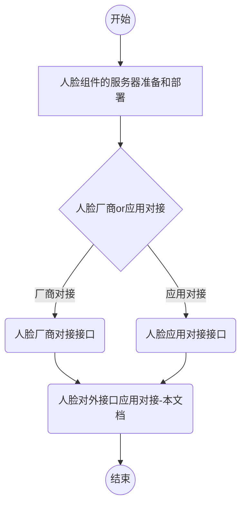

# 开发前须知
### 人脸实施对接步骤

上图中整体流程为：

1. 锐捷实施人员准备和部署人脸组件服务器。

2. 人脸对接。

   人脸厂商对接：厂商方开发由SID制定的【人脸厂商标准接口】，开发完成后，SID调用相关接口实现对接。

   人脸应用对接：应用方开发由SID制定的【人脸应用标准接口】，开发完成后，SID调用相关接口实现对接。

   人脸对外服务：应用调用SID提供的【人脸对外接口】，进行人脸对接。

#### 人脸组件的服务器准备和部署

具体部署步骤详见：[SID人脸环境部署](/faceid/deployment/deployment.html)。

#### 人脸厂商、人脸应用对接

人脸厂商对接需开发的接口详见：[人脸厂商标准接口](/faceid/manufacturer/interface/manufacture.html)。

人脸应用对接需开发的接口详见：[人脸应用标准接口](/faceid/manufacturer/interface/application.html)。

#### 人脸对外接口应用对接步骤

应用使用SID的人脸服务，即调用[人脸对外接口](/faceid/public/interface/face-external-api.html)，需在接口调用前进行以下步骤：

**STEP 1**：管理端[注册应用](/application-register.html)。

**STEP 2**：认证API调用配置。

“进入配置”，然后进行认证API调用配置。

记录下应用的应用ID、应用秘钥，并启用“认证API调用配置”。

**STEP 3**：配置人脸服务。

点击人脸服务配置的“进入配置”，进而配置人脸服务。

根据页面导航，配置应用的人脸服务（注：应用同步用户数据、应用数据转换必须配置）

**STEP 4**：根据应用的应用ID（对应username）、应用秘钥（对应password）获取token，获取方式请参考：[获取JWT](/get-JWT.html)。

**STEP 5**：将token加入Header中，测试或对接人脸服务公共接口。

