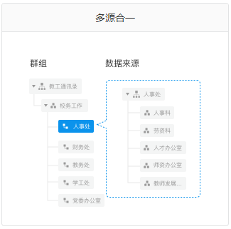
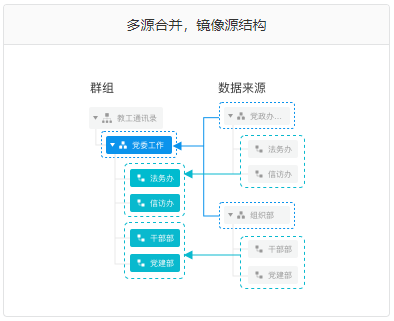
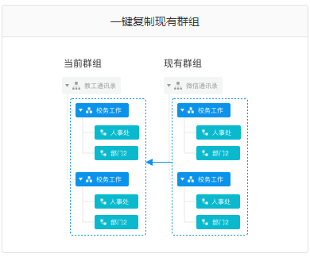
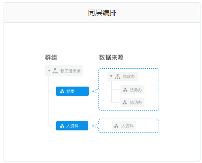
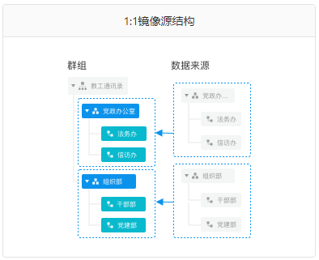
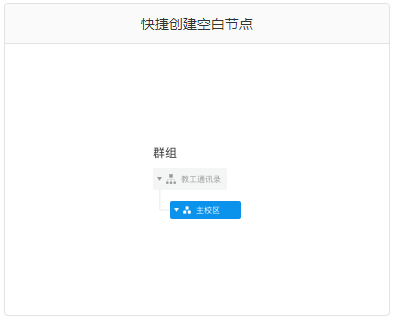

# FAQ

#### 1. 群组人员删除后，是否自动删除应用端人员

视SID是否配置群组回收站而定。

1. 配置回收站：群组人员删除后，不会自动删除应用端人员。
2. 未配置回收站：群组人员删除后，将自动删除应用端人员。

#### 2. 6种节点模板

在创建群组节点时为了能够快速定义和编排， SID提供六种模板选择：多源合一、同层编排、多源合并，镜像源结构、1:1镜像源结构、一键复制现有群组、快速创建空白节点。

* 多源合一。多个数据源合并为一个群组节点，即将下图中的“人事科”、“劳资科”等多个数据来源节点合并为“人事处”节点。

* 多源合并，镜像源结构。多个数据来源节点合并为一个，不改变子节点，即将下图中的“党政办”和“组织部”数据来源节点合并为“党委工作”节点，而右边”法务办“、”信访办“数据源节点复制到左边群组中后与”党政工作“节点为父子关系。

- 一键复制现有群组。从一个已定义的群组复制形成新的群组结构，如下图。

- 同层编排。多个多源合一模式的组合，即将下图中的党政办及其子节点通过多源合一模式形成”党委“节点，而人资科通过多源合一模式形成”人资科“节点。

- 1:1镜像源结构。多个一键复制现有群组模式的组合，即将党政办及其子节点直接复制形成”党委“及其子节点，而组织部及其子节点直接复制形成”组织部“及其子节点。

- 快捷创建空白节点，如下图。

