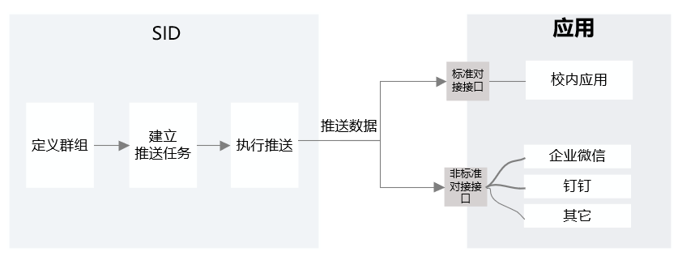

# 开发前须知
>[群组概念](#link1)
>
>[群组业务总体架构](#link2)
>
>[群组对接技术说明](#link3)
>
>[标准对接接口开发步骤](#link4)

#### 群组概念

群组是带有层级关系的用户组，其中“用户组”是指“具有相似特性或相似权利的用户的集合”。

“群组”与“组织”的区别在于，“组织”只能通过部门定义用户所在节点的层级关系，“群组”可以将“身份标签”(如男性、党员）、“身份类型”（如教职工、学生）与“组织”结合，更加灵活地组合定义。

#### 群组业务总体架构

如下图，用户在SID中新建一个群组并推送群组数据后，应用将通过对接接口接收请求数据，并根据请求进行节点和人员的查询、新增、修改、删除，与SID同步群组数据。

应用通过标准对接接口方式或非标准对接接口方式进行群组同步。其中，

标准对接接口：由锐捷提供，应用端需要实现该接口进行群组同步。适用于校内应用。

非标准对接接口：由应用端自身提供，锐捷需要进行适当的对接开发。适用于企业微信、钉钉等应用。

#### 群组对接技术说明

- 群组同步方式：推送方式，即SID调用应用端群组对接接口进行实时或定时增量推送，也可手动推送（增量和全量方式）。
- 标准对接接口开发采用RESTful方式。
- 针对采用非标准对接接口的群组同步方式，应用端需要联系锐捷研发，并提供平台的组织或群组对接API，锐捷研发人员将对SID进行定制化开发。

#### 标准对接接口开发步骤

**STEP 1**：获取APPID、APPSECRET，验证SID请求数据的合法性。验证方法参考：[群组推送安全验证](/group/develop/safety-verification.html)。

APPID、APPSECRET是锐捷和应用方约定（任一方提供时，另一方与其保持一致即可）的一组数据。

**STEP 2**：开发标准对接接口。

标准对接接口开发需要实现9个接口，便于SID调用，接口分为两类：

1. [群组节点管理](/group/develop/node-management.html)

   创建群组节点：新建一个群组节点。

   更新群组节点：更新某个群组节点的信息。

   删除群组节点：删除某个群组节点。

   查询某个群组节点：查询某个群组节点及子节点信息。

2. [人员管理](/group/develop/personnel-management.html)

   创建成员：新建一个人员信息。

   更新成员：更新某个人员的信息。

   删除成员：删除某个人员信息。

   查询成员：查看某个人员的信息。

   获取群组节点下成员：查询某个群组节点下有哪些人员。

**STEP 3**：建立群组并推送群组数据。

1. [定义并发布一个群组](/group/procedure/define-group.html)。
2. [建立群组推送任务](/group/procedure/create-push-task.html)。
3. [推送群组数据](/group/procedure/push-task.html)。

**STEP 4**：测试并修改已编写的接口。