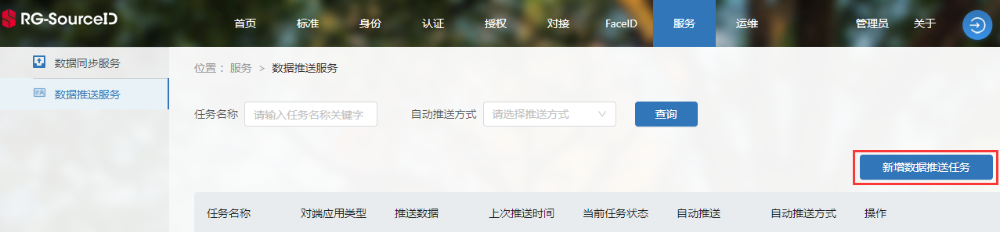
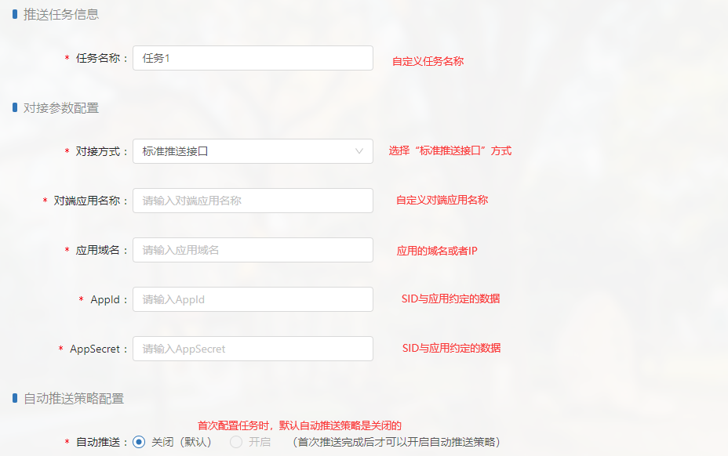
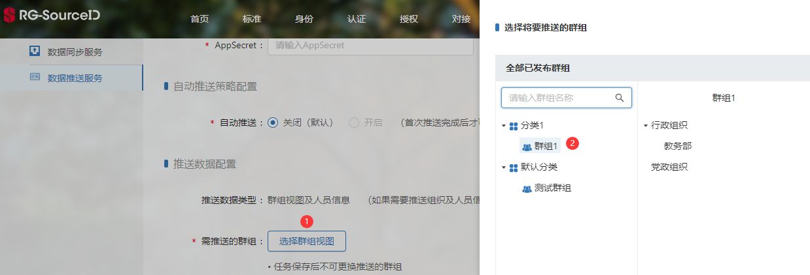

# 建立群组推送任务

建立群组推送任务将创建一个推送群组数据的任务，执行该任务，即可手动或自动同步数据。

新增数据推送任务。在服务->数据推送服务->新增数据推送任务，点击“新增数据推送任务”按钮，可进入任务配置页面。

配置任务名称、对接参数、自动推送策略。

配置需推送的群组数据，具体分为群组节点和用户：

（1）选择需推送的群组节点。点击“选择群组视图”，选择某个已发布的群组，该群组中的节点将会被推送给应用；

（2）选择需推送的用户和需同步的用户属性。首先选择需推送的用户类型（身份类型）；其次，在“操作”列中点击“选择”按钮，弹出SID用户数据项；最后，选择需与应用端同步的用户属性，点击“确定”按钮保存信息。

