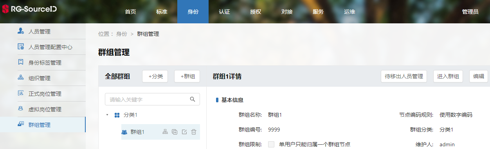
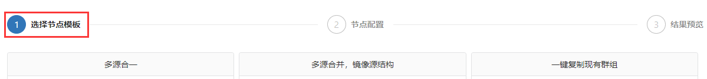
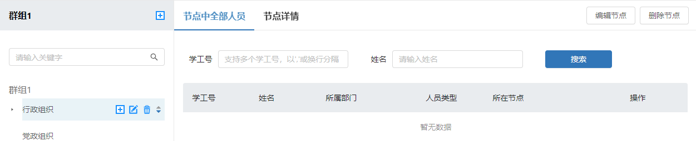

# 定义并发布一个群组
>1. [新建群组基本信息](#link1)
>2. [创建群组节点](#link2)
>3. [发布群组](#link3)

定义并发布一个群组将在某个群组分类（避免定义太多群组后，不好管理等问题）下新建一个群组，包括群组基本信息、群组节点、人员，并发布该群组。当群组状态为“已发布”时，该群组数据才能被推送。

#### 新建群组基本信息

新建一个群组的基本信息，包括群组名称、群组分类、群组描述。在身份->群组管理->群组，点击“群组”按钮，即可编辑基本信息。

#### 创建群组节点

进入某个群组。在身份->群组管理->进入群组，点击“进入群组”按钮，即可进入某个群组创建群组节点。

新建群组节点。进入群组后，点击“群组节点管理”标题下的“+”按钮，即可开始编辑群组节点。

选择节点模板。共有6种模板可供选择。

选择群组的数据来源。以“1:1镜像源结构”模板为例，点击“选择组织部门”按钮，选择作为数据源的部门，点击“确定”按钮后，可看到已选的数据源。其中，人员匹配条件用来筛选已选择数据源节点上的用户。

预览群组节点和群组节点上的用户。该步骤可预览群组结构以及每个节点内的人员清单。

查看已创建的群组信息。在结果预览页面，点击“保存”按钮，即可看到新增的群组信息。

#### 发布群组

发布群组。在身份->群组管理->发布当前群组，点击“发布当前群组”按钮，群组状态将变为“已发布”。群组发布后，即可推送该群组数据。

