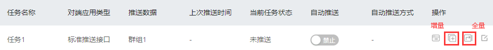
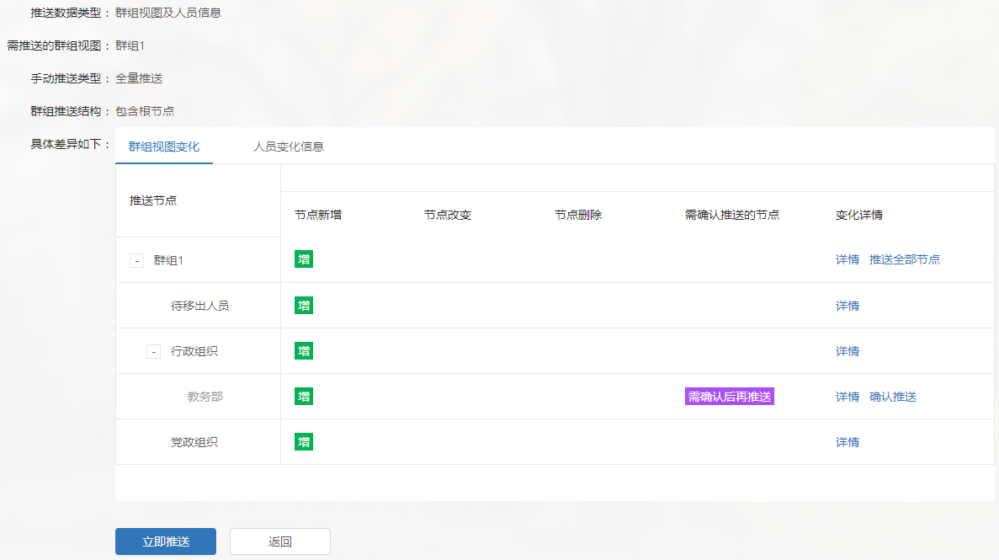
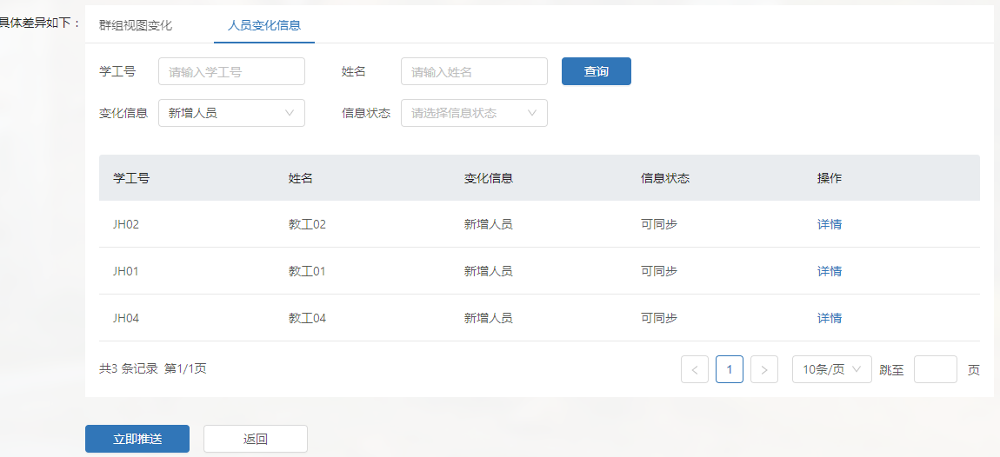
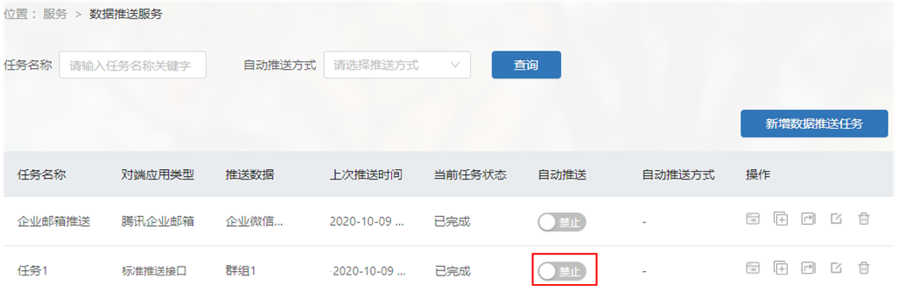
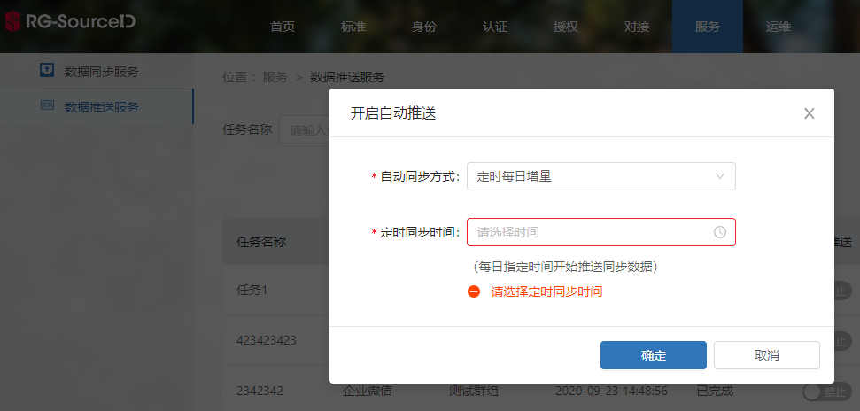

# 推送群组数据
>1. [手动推送群组数据](#link1)
>2. [设置自动推送](#link2)

推送群组数据为SID通过调用应用端接口，实现与应用的群组同步。

群组推送支持自动同步和手动同步。其中，

- 自动同步分为每日定时增量同步和实时增量同步。
- 手动同步分为增量同步和全量同步。

#### 手动推送群组数据

手动推送群组数据分为全量推送和增量推送，其中，

- 全量推送：推送当前群组的所有数据。
- 增量推送：推送当前群组相较于上次成功推送数据的变化信息。

在服务->数据推送服务，点击下图操作列中“增量推送”或者“全量推送”按钮，与应用增量或全量同步。

查看当前群组相较于上次成功推送数据的变化信息，点击“立即推送”按钮，可执行推送。

说明：

全量推送时，对于未变动的节点或用户，SID需先调用应用的查询接口，查询有无节点或用户信息，不存在时调用新增接口，应用进行新增操作；存在则调用更新接口，应用进行更新操作。

#### 设置自动推送

只有完成一次数据推送后，保证所有配置是正常的情况下，才能打开自动推送。自动推送只有增量推送方式。

打开自动推送按钮。在服务->数据推送服务->自动推送，点击“自动推送”按钮，设置任务为自动推送。

定时增量、或者实时增量推送数据。点击自动推送按钮后，界面会自动弹出一个配置框，选择每日定时增量、或者实时增量即可。

