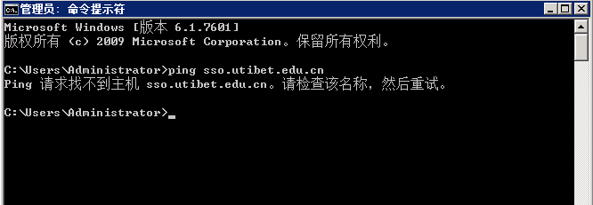
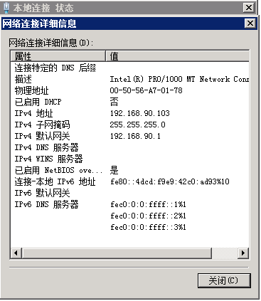
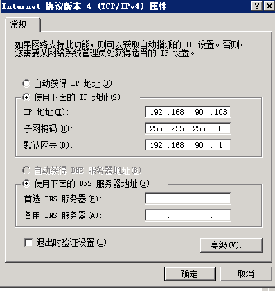

# FAQ

>[对接前提：检查网络是否互通](#1)

#### 对接前提：检查网络是否互通（不通则找学校业务负责人）

1、查看是否能Ping通sso域名，示例如图：

（1）通，联系锐捷方人员找出报错原因并解决。

（2）不通，继续查看是否设置了DNS，示例如图：

上图中IPv4 DNS服务器没有值，因此未设置DNS。

1）设置了DNS，联系锐捷方人员找出报错原因并解决。

2）未设置DNS（**没有DNS联系学校业务负责人获取**）时，请设置DNS，设置方式示例如图：

在上图中的首选DNS服务器中设置DNS。

设置好DNS后重新调试，若仍出现报错信息，联系锐捷方人员找出报错信息并解决。

