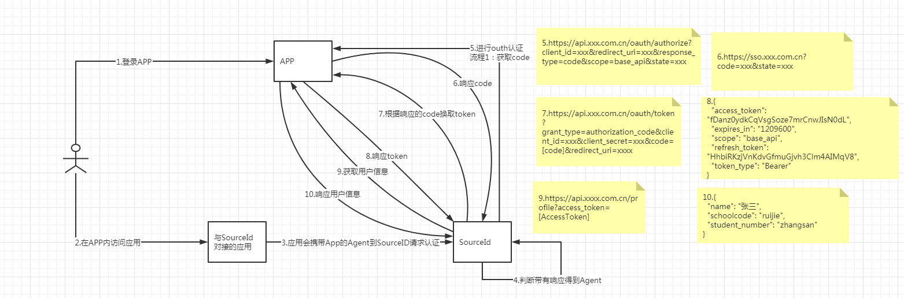

# APP内应用免认证
>[准备工作](#0)
>- [OAuth2.0授权码支持](#1)
>- [提供appKey和secret给sso](#2)
>- [支持OAuth的三个接口](#3)

>[对接原理](#4)

>[缓存方案建议](#5)

#### 准备工作

在对接之前，应用需做以下3点准备工作：

##### 1、APP支持标准的OAuth授权码模式支持
  流程简介：
- 获取code
- code换token
- token换用户信息
##### 2、提供appKey和secret给sso

- 将sso域名注册到APP应用中，并且提供appKey和secret

##### 3、支持OAuth的三个接口 
见接口文档
[OAuth认证接口](/linkid/authentication/public/interface/application-free-certification.html)。

#### 对接原理

#### 缓存方案建议
通过OAuth验证接口获取成员身份会有一定的时间开销。对于频繁获取成员身份的场景，建议采用如下方案：
- 应用中的URL链接直接填写企业自己的页面地址
- 成员操作跳转到步骤1的企业页面时，企业后台校验是否有标识成员身份的cookie信息，此cookie由企业生成
- 如果没有匹配的cookie，则重定向到OAuth验证链接，获取成员的身份信息后，由企业后台植入标识成员身份的cookie信息
- 根据cookie获取成员身份后，再进入相应的页面

