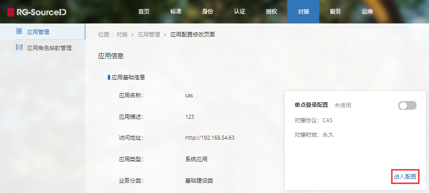
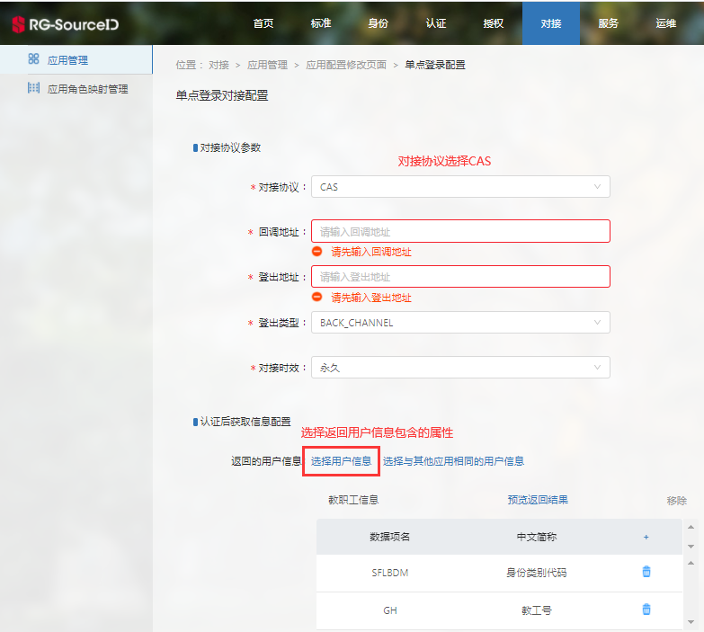
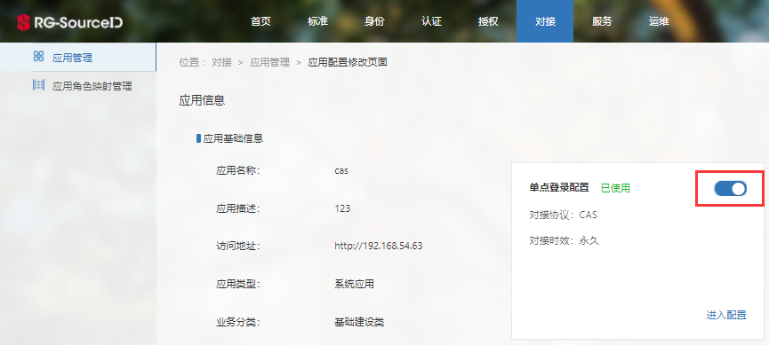

# CAS单点对接

>[准备工作](#0)
>
>- [网络检查](#1)
>- [应用注册、配置](#2)
>- [集成CAS Client](#3)
>
>[CAS单点对接](#4)

#### 准备工作<a id=0></a>

在测试或对接之前，应用需做以下3点准备工作：

##### 1、网络检查<a id=1></a>

[检查网络是否互通](/linkid/authentication/faq/faq.html#1)（如DNS），不通则找学校业务负责人。

##### 2、应用注册、配置<a id=2></a>

（1）[应用注册](/application-register.html)。

（2）单点登录对接配置-进入配置。



（3）配置CAS单点登录对接相关信息。



注：

- 回调地址采用地址匹配模式，可匹配该地址的子集地址。

- cas登出方式有两种方式：

  **前端登出(FRONT_CHANNEL)：**用户点击logout链接（链接地址为cas登出地址）时，浏览器跳转到cas登出地址，cas登出页面给对接应用发送jsonp的登出请求，达到登出效果。注意：前端登出不支持cas会话超时自动登出。

  **后端登出(BACK_CHANNEL)：**是当TGT超时时，或者用户通过链接访问cas登出地址时，cas服务器直接给应用服务器发送登出请求，以达到登出效果。

（4）启用配置。



##### 3、集成CAS Client<a id=3></a>

（1）配置maven环境依赖。

```Java
<dependency>
    <groupId>org.jasig.cas.client</groupId>
    <artifactId>cas-client-core</artifactId>
    <version>3.5.0</version>
</dependency>
```

也可从https://mvnrepository.com/artifact/org.jasig.cas.client/cas-client-core地址下载。

（2）配置应用程序部署描述文件 (web.xml)

**说明：**

- 下文内{server}表示sso地址，示例：http://ljw.sso.rghall.com.cn。
- sso的登录地址、ticket验证地址、登出地址详见：[CAS认证接口](/linkid/authentication/public/interface/cas-authentication.html)。

1）必备配置。设置serverName、监听类。serverName为登陆成功或者退出成功的应用回调地址。

```xml
<context-param>
    <param-name>serverName</param-name>
    <param-value>http://localhost:8080</param-value>
</context-param>
<listener>
    <listener-class>
    	org.jasig.cas.client.session.SingleSignOutHttpSessionListener
    </listener-class>
</listener>
```

2）配置AuthenticationFilter（需要配置sso登录地址）。

>AuthenticationFilter的作用是用于拦截SSO登陆请求的，当你提交的request符合SSO登陆规则，CAS client会通过这个filter将登陆请求转向到CAS server的登陆界面。因为这是第一步，所以它要在最上面。

```
<!--该过滤器负责用户未登录时，跳转到认证页面进行登录-->
<filter>
    <filter-name>CAS Authentication Filter</filter-name>
    <filter-class>
    	org.jasig.cas.client.authentication.AuthenticationFilter
    </filter-class>
    <init-param>
    <!--配置sso登录地址-->
        <param-name>casServerLoginUrl</param-name>
        <param-value>{server}/login</param-value>
    </init-param>
</filter>
<filter-mapping>
    <filter-name>CAS Authentication Filter</filter-name>
    <url-pattern>/*</url-pattern><!—拦截路径-->
</filter-mapping>
```

3）配置TicketValidationFilter（需要配置ticket验证地址）。

>用于拦截登陆返回的跳转请求的。当CAS server确认登陆用户名密码后，会返回一个server ticket，这个ticket会由应用服务器上的CAS client再送回CAS server进行验证，用于防止仿冒攻击的。

```
<!--该过滤器负责对ticket的校验工作-->
<filter>
    <filter-name>CAS Validation Filter</filter-name>
    <filter-class>
    	org.jasig.cas.client.validation.Cas30ProxyReceivingTicketValidationFilter
    </filter-class>
    <init-param>
    <!--配置sso的ticket验证地址-->
        <param-name>casServerUrlPrefix</param-name>
        <param-value>{server}/p3</param-value>
    </init-param>
    <init-param>
        <!--验证后是否重定向-->
        <param-name>redirectAfterValidation</param-name>
        <param-value>true</param-value>
    </init-param>
    <init-param>
        <!--服务器与客户端的误差时间-->
        <param-name>tolerance</param-name>
        <param-value>5000</param-value>
    </init-param>
</filter>
    <filter-mapping>
        <filter-name>CAS Validation Filter</filter-name>
        <url-pattern>/*</url-pattern><!--拦截路径-->
</filter-mapping>
```

注：

org.jasig.cas.client.validation.Cas30ProxyReceivingTicketValidationFilter为CAS3.0协议。CAS2.0协议请配置org.jasig.cas.client.validation.Cas20ProxyReceivingTicketValidationFilter，同时配置：casServerUrlPrefix为{server}，不带“/p3”。

4）配置HttpServletRequestWrapperFilter。

>目的是将CAS server返回的信息封装到Http request里面，这样客户端就可以用request.getRemoteUser()来获取用户名等信息了。

```
<filter>
    <filter-name>
    	CAS HttpServletRequest Wrapper Filter
    </filter-name>
    <filter-class>
    	org.jasig.cas.client.util.HttpServletRequestWrapperFilter
    </filter-class>
</filter>
<filter-mapping>
    <filter-name>
    	CAS HttpServletRequest Wrapper Filter
    </filter-name>
    <url-pattern>/*</url-pattern>
</filter-mapping>
```

5）配置AssertionThreadLocalFilter。

>是用于前端程序（通常是前端脚本程序）访问，因为这个时候无法通过request来获取信息。

```
<filter>
    <filter-name>
    	CAS Assertion Thread Local Filter
    </filter-name>
    <filter-class>
    	org.jasig.cas.client.util.AssertionThreadLocalFilter
    </filter-class>
</filter>
<filter-mapping>
    <filter-name>
    	CAS Assertion Thread Local Filter
    </filter-name>
    <url-pattern>/*</url-pattern>
</filter-mapping>
```

（6）配置SingleSignOutFilter。

>用于拦截登出路径，清除登录信息。

```
<filter>
    <filter-name>
    	CAS Single Sign Out Filter
    </filter-name>
    <filter-class>
    	org.jasig.cas.client.session.SingleSignOutFilter
    </filter-class>
</filter>
<filter-mapping>
    <filter-name>
    	CAS Single Sign Out Filter
    </filter-name>
    <url-pattern>/*</url-pattern>
</filter-mapping>
```

#### CAS单点对接<a id=4></a>

准备工作完成后，开发人员可进行测试或单点对接。

对接成功后，可使用如下代码获取登陆用户名和用户信息：

```
//在应用程序中获取用户信息
AttributePrincipal principal = (AttributePrincipal)request.getUserPrincipal();
String username = principal.getName();

//获取用户属性的示例代码如下：
Map attributes = principal.getAttributes(); 
String email=attributes.get("age");   //获取需要的属性，key填属性名即可
```
