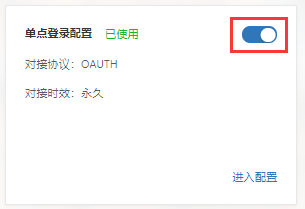

# OAuth2.0单点对接

>[准备工作](#0)
>
>- [网络检查](#1)
>- [应用注册、配置](#2)
>
>[OAuth2.0单点对接](#3)

#### 准备工作

在测试或对接之前，应用需做以下2点准备工作：

##### 1、网络检查

[检查网络是否互通](/linkid/authentication/faq/faq.html#1)（如DNS），不通则找学校业务负责人。

##### 2、应用注册、配置

（1）[应用注册](/application-register.html)。

（2）单点登录对接配置-进入配置。

（3）配置OAuth2单点登录对接相关信息。

注：

- 回调地址采用地址匹配模式，可匹配该地址的子集地址。
- 目前的登出类型为**前端登出(FRONT_CHANNEL)**。即使用href引用登出地址的方式登出，登出后浏览器跳转到统一认证页面。这种方式要求应用的协议与cas的传输协议一致（当cas是https协议时，则应用也必须是https）。前端登出方式达不到cas会话超时自动登出的效果。
- 记录下应用ID、应用秘钥，以便应用请求SID认证接口。

（4）启用配置。

#### OAuth2.0单点对接

准备工作完成后，开发人员调用[OAuth2.0认证接口](/linkid/authentication/public/interface/oauth-authentication.html)可实现测试或单点对接。