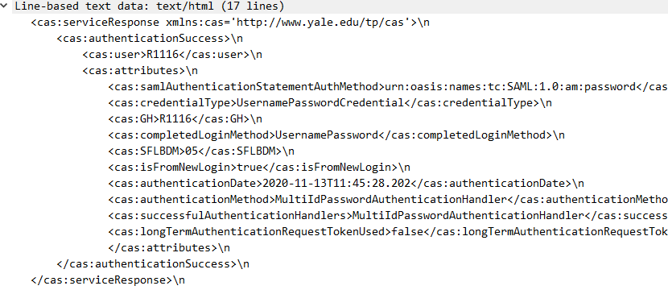
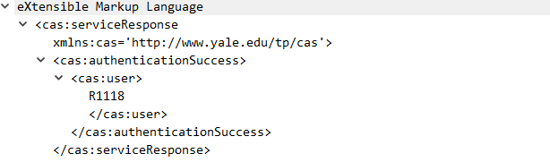

# CAS认证接口
> [用户认证](#1)
>
> [请求验证ticket](#2)
>
> [cas登出](#3)


#### 一、用户认证

> 应用向SID认证服务器请求认证，SID返回认证页面。
>

#### 一、用户认证<a id=1></a>

**请求⽅式：** GET（**HTTPS或HTTP**）

**请求地址：** http://{server}/login

**请求参数：**

```javascript
请求示例：
http://ljw.sso.rghall.com.cn/login?service=xxx
```

**参数说明：**

| **参数** | **是否必须** | **说明**                               |
| -------- | ------------ | -------------------------------------- |
| service  | 是           | SID要跳转的地址，即SID下发ticket的地址 |

**返回结果：**

无

**参数说明：**

| **参数** | **说明**                                        |
| -------- | ----------------------------------------------- |
| ticket   | 票据。ticket参数在service指向的url里，由SID下发 |


#### 二、请求验证ticket<a id=2></a>

> 应用携带SID下发的ticket，请求SID验证ticket的有效性，SID验证成功后返回用户信息。

**1、CAS3.0协议请求验证ticket**

**请求⽅式：** GET（**HTTPS或HTTP**）

**请求地址：** http://{server}/p3/serviceValidate

**请求参数：**

```javascript
请求示例：
http://ljw.sso.rghall.com.cn/p3/serviceValidate?ticket=xxx&service=xxx
```

**参数说明：**

| **参数** | **是否必须** | **说明**                  |
| -------- | ------------ | ------------------------- |
| ticket   | 是           | SID下发的票据             |
| service  | 是           | 和用户验证中的service相同 |

**返回结果：**

SID返回xml格式的用户信息，如下图：



**参数说明：**

| **参数** | **说明**                                                     |
| -------- | ------------------------------------------------------------ |
| 用户信息 | 用户信息为xml格式，包括用户登录名。返回的用户属性可在SID中配置。 |

**2、CAS2.0协议请求验证ticket。**

**请求⽅式：** GET（**HTTPS或HTTP**）

**请求地址：** http://{server}/serviceValidate

**请求参数：**

```javascript
请求示例：
http://ljw.sso.rghall.com.cn/serviceValidate?ticket=xxx&service=xxx
```

**参数说明：**

| **参数** | **是否必须** | **说明**                  |
| -------- | ------------ | ------------------------- |
| ticket   | 是           | SID下发的票据             |
| service  | 是           | 和用户验证中的service相同 |

**返回结果：**

SID返回xml格式的用户信息，如下图：



**参数说明：**

| **参数** | **说明**                                                     |
| -------- | ------------------------------------------------------------ |
| 用户信息 | 用户信息为xml格式，包括用户登录名。返回的用户属性可在SID中配置。 |


#### 三、cas登出<a id=3></a>

> CAS登出。

**请求⽅式：** GET（**HTTPS或HTTP**）

**请求地址：** http://{server}/logout

cas登出方式有两种方式：前端登出(FRONT_CHANNEL)和后端登出(BACK_CHANNEL)。

**前端登出：**是在用户点击logout链接（链接地址为cas登出地址）时，浏览器跳转到cas登出地址，cas登出页面给对接应用发送jsonp的登出请求，达到登出效果。注意：前端登出不支持cas会话超时自动登出。

**后端登出：**是当TGT超时时，或者用户通过链接访问cas登出地址时，cas服务器直接给应用服务器发送登出请求，以达到登出效果。
