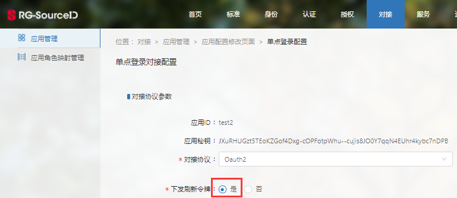

# OAuth认证接口

>[授权码模式](#1)
>
>[密码模式](#2)
>
>[客户端模式](#3)
>
>[微信公众号对接](#4)
>
>[单点登出](#5)

## 一、授权码模式<a id=1></a>

#### 1、用户认证

> 跳转到SID认证中心认证用户。

**请求⽅式：** GET（**HTTPS或HTTP**）

**请求地址：** http://{server}/oauth2.0/authorize

**请求参数：**

```javascript
请求示例：
http://ljw.sso.rghall.com.cn/oauth2.0/authorize?response_type=code&client_id=xxx&redirect_uri=xxx
```

**参数说明：**

| **参数**      | **是否必须** | **说明**                   |
| ------------- | ------------ | -------------------------- |
| response_type | 是           | 授权码模式，这里固定为code |
| client_id     | 是           | 应用id                     |
| redirect_uri  | 是           | 应用回调地址               |
| scope         | 否           | 权限列表，以空格分隔。     |

**返回结果：**

```
返回code
```

**参数说明：**

| **参数** | **说明**                                          |
| -------- | ------------------------------------------------- |
| code     | SID跳转到redirect_uri时，code参数会附带在该地址中 |

#### 2、用code获取access_token

> 使用code获取access_token。

**请求⽅式：** POST（**HTTPS或HTTP**）

**请求地址：** http://{server}/oauth2.0/accessToken

**请求头（header）：** 

Content-Type：multipart/form-data

**请求参数：**

```javascript
{
    "grant_type":authorization_code,
    "client_id":xxx,
    "client_secret":xxx,
    "redirect_uri":xxx,
    "code":xxx
}
```

**参数说明：**

| **参数**      | **是否必须** | **说明**                                 |
| ------------- | ------------ | ---------------------------------------- |
| grant_type    | 是           | 授权码模式，这里固定为authorization_code |
| client_id     | 是           | 应用id                                   |
| client_secret | 是           | 应用秘钥                                 |
| redirect_uri  | 是           | 应用回调地址                             |
| code          | 是           | 授权码                                   |

**返回结果：**

```java
{
    "access_token":xxx,
    "token_type":xxx,
    "expires_in":xxx,
    "refresh_token":xxx
}
```

**参数说明：**

| **参数**      | **说明**                                                     |
| ------------- | ------------------------------------------------------------ |
| access_token  | 访问令牌                                                     |
| token_type    | 令牌类型                                                     |
| expires_in    | 令牌有效期                                                   |
| refresh_token | 刷新令牌，该参数只有在SID中将下发刷新令牌勾选为“是”时才会返回 |

注：获取refresh_token参数的值需先在SID中选择“下发刷新令牌”，如下图：



#### 3、获取用户信息

> 使用access_token获取用户信息。

**请求⽅式：** GET/POST（**HTTPS或HTTP**）

**请求地址：** http://{server}/oauth2.0/profile

**请求头（header）：** 

Content-Type：multipart/form-data

注：使用get请求时，不用添加请求头。

**请求参数：**

```javascript
{
    "access_token":xxx
}
```

**参数说明：**

| **参数**      | **是否必须** | **说明**     |
| ------------- | ------------ | ------------ |
| access_token  | 是           | 访问令牌     |

**返回结果（老师）：**

```java
{
    "active": true,
    "attributes": {
        "DQZTM": "在任",
        "DWH": "网络信息与综合服务中心",
        "DWM": "306000",
        "GH": "20042020",
        "PRZWMC": "工程师",
        "SFLBDM": "01",
        "XBM": "男性",
        "XM": "xxxx"
        "SFLBMC": "xxx"
        },
    "id": "20042020",
    "client_id": xxx
}
```

**参数说明：**

| **参数**   | **说明**     |
| ---------- | ------------ |
| id         | 用户名       |
| client_id  | 应用id       |
| attributes | 用户属性列表 |
| XM         | 姓名         |
| XBM        | 性别         |
| SFLBDM     | 身份类别代码 |
| GH         | 工号         |
| PRZWMC     | 职位名称     |
| DWM        | 单位名       |
| DWH        | 单位号       |
| DQZTM      | 当前状态     |
| ZWJBMC     | 职务级别名称 |
| SFLBMC     | 身份类别名称 |


## 二、密码模式<a id=2></a>

#### 1、获取access_token

> 获取access_token。

**请求⽅式：** GET（**HTTPS或HTTP**）

**请求地址：** http://{server}/oauth2.0/accessToken

**请求参数：**

```javascript
请求示例：
http://ljw.sso.rghall.com.cn/oauth2.0/accessToken?grant_type=password&client_id=xxx&username=xxx&password=xxx
```

**参数说明：**

| **参数**   | **是否必须** | **说明**             |
| ---------- | ------------ | -------------------- |
| grant_type | 是           | 密码模式为password   |
| client_id  | 是           | 应用id               |
| username   | 是           | 用户名               |
| password   | 是           | 密码                 |
| scope      | 否           | 权限列表，以空格分隔 |

**返回结果：**

```java
{
    "access_token": "AT-1-IWyhZhU1hKKvWPddAJpdHRN2ECu08Ypo",
    "token_type": "bearer",
    "expires_in": 28800,
    "refresh_token": "RT-1-cvHg23sAYRfu-1h8e57U9PSGK1qyL-mW"
}
```

**参数说明：**

| **参数**      | **说明**                                                     |
| ------------- | ------------------------------------------------------------ |
| access_token  | 访问令牌                                                     |
| token_type    | 令牌类型                                                     |
| expires_in    | 令牌有效期                                                   |
| refresh_token | 刷新令牌，该参数只有在SID中将下发刷新令牌勾选为“是”时才会返回 |

#### 2、获取用户信息

> 使用access_token获取用户信息。

**请求⽅式：** GET/POST（**HTTPS或HTTP**）

**请求地址：** http://{server}/oauth2.0/profile

**请求头（header）：** 

Content-Type：multipart/form-data

注：使用get请求时，不用添加请求头。

**请求参数：**

```javascript
{
    "access_token":xxx
}
```

**参数说明：**

| **参数**     | **是否必须** | **说明** |
| ------------ | ------------ | -------- |
| access_token | 是           | 访问令牌 |

**返回结果（老师为例）：**

```java
{
    "attributes": {
        "DQZTM": "在任",
        "DWH": "网络信息与综合服务中心",
        "DWM": "306000",
        "GH": "20042020",
        "PRZWMC": "工程师",
        "SFLBDM": "01",
        "XBM": "男性",
        "XM": "xxxx"
        "SFLBMC": "xxx"
        },
    "id": "20042020"
}
```

**参数说明：**

| **参数**   | **说明**     |
| ---------- | ------------ |
| id         | 用户名       |
| attributes | 用户属性列表 |
| XM         | 姓名         |
| XBM        | 性别         |
| SFLBDM     | 身份类别代码 |
| GH         | 工号         |
| PRZWMC     | 职位名称     |
| DWM        | 单位名       |
| DWH        | 单位号       |
| DQZTM      | 当前状态     |
| ZWJBMC     | 职务级别名称 |
| SFLBMC     | 身份类别名称 |

#### 3、使用刷新令牌获取access_token

> 通过刷新令牌获取access_token。

**请求⽅式：** GET/POST（**HTTPS或HTTP**）

**请求地址：** http://{server}/oauth2.0/accessToken

**请求头（header）：** 

Content-Type：multipart/form-data

注：使用get请求时，不用添加请求头。

**请求参数：**

```javascript
{
    "grant_type":refresh_token,
    "client_id":xxx,
    "client_secret":xxx,
    "refresh_token":xxx
}
```

**参数说明：**

| **参数**      | **是否必须** | **说明**            |
| ------------- | ------------ | ------------------- |
| grant_type    | 是           | 固定为refresh_token |
| client_id     | 是           | 应用id              |
| client_secret | 是           | 应用秘钥            |
| refresh_token | 是           | 刷新令牌            |

**返回结果：**

```java
{
    "access_token": "AT-1-IWyhZhU1hKKvWPddAJpdHRN2ECu08Ypo",
    "token_type": "bearer",
    "expires_in": 28800
}
```

**参数说明：**

| **参数**     | **说明**   |
| ------------ | ---------- |
| access_token | 访问令牌   |
| token_type   | 令牌类型   |
| expires_in   | 令牌有效期 |


## 三、客户端模式<a id=3></a>

#### 1、获取access_token

> 获取access_token。

**请求⽅式：** GET（**HTTPS或HTTP**）

**请求地址：** http://{server}/oauth2.0/accessToken

**请求参数：**

```javascript
请求示例：
http://ljw.sso.rghall.com.cn/oauth2.0/accessToken?grant_type=client_credentials&client_id=xxx&client_secret=xxx
```

**参数说明：**

| **参数**      | **是否必须** | **说明**                                 |
| ------------- | ------------ | ---------------------------------------- |
| grant_type    | 是           | 客户端模式，这里固定为client_credentials |
| client_id     | 是           | 应用id                                   |
| client_secret | 是           | 应用秘钥                                 |
| scope         | 否           | 权限列表，以空格分隔                     |

**返回结果：**

```java
{
    "access_token": "AT-1-IWyhZhU1hKKvWPddAJpdHRN2ECu08Ypo",
    "token_type": "bearer",
    "expires_in": 28800
}
```

**参数说明：**

| **参数**     | **说明**   |
| ------------ | ---------- |
| access_token | 访问令牌   |
| token_type   | 令牌类型   |
| expires_in   | 令牌有效期 |


## 四、微信公众号对接<a id=4></a>

#### 1、跳转认证

> 跳转到SID认证中心认证用户。

**请求⽅式：** GET（**HTTPS或HTTP**）

**请求地址：** http://{server}/oauth2.0/authorize

**请求参数：**

```java
请求示例：
http://ljw.sso.rghall.com.cn/oauth2.0/authorize?response_type=code&client_id=xxx&redirect_uri=xxx&openid=xxx&from=xxx
```

**参数说明：**

| **参数**      | **是否必须** | **说明**                                       |
| ------------- | ------------ | ---------------------------------------------- |
| response_type | 是           | 授权码模式，值为code                           |
| client_id     | 是           | 应用id                                         |
| redirect_uri  | 是           | 应用回调地址                                   |
| openid        | 否           | 用户的微信openid, openid和unionid只需传一个    |
| unionid       | 否           | 用户的微信unionid, openid和unionid只需要传一个 |
| from          | 是           | openid/unionid来源，这里填APPID                |
| scope         | 否           | 权限列表，以空格分隔                           |

**返回结果：**

```
返回code
```

**参数说明：**

| **参数** | **说明**                                                  |
| -------- | --------------------------------------------------------- |
| code     | 授权码。SID跳转到redirect_uri时，code参数会附带在该地址中 |

子应用按照OAuth2.0 授权码模式接入，具体接口请参考：[授权码模式](#1)


## 五、单点登出<a id=5></a>

目前可以使用下面两种方式登出：

1、如果使用href引用登出地址的方式登出，登出后浏览器跳转到统一认证页面。这种方式要求应用的协议与cas的传输协议一致（由于目前cas是https协议，则应用也必须是https）。此方式只支持**前端登出**(FRONT_CHANNEL)，故达不到cas会话超时自动登出的效果。

2、如果使用jsonp的方式发送登出请求，则不会跳转。此种方式只能达到对接的cas应用登出和发起登出请求的OAuth应用登出效果， 对于其他OAuth应用则达不到登出效果。