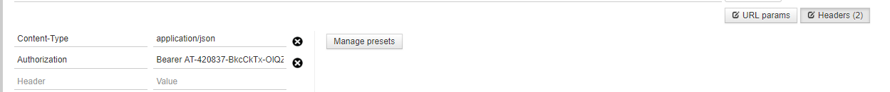

# 开发前须知

>[接口规范说明](#1)
>
>[角色接口调用授权](#2)

#### 接口规范说明：

1. 各类数据内容返回， 属性名为驼峰式， 以文档示例为准

2. 分页接口， 分页参数属性是驼峰式， 以文档示例为准

   

#### 接口调用授权：

* [获取accessToken](../../../get-access-token.md)
* 设置请求头 Authorization: Bearer {access_token}

