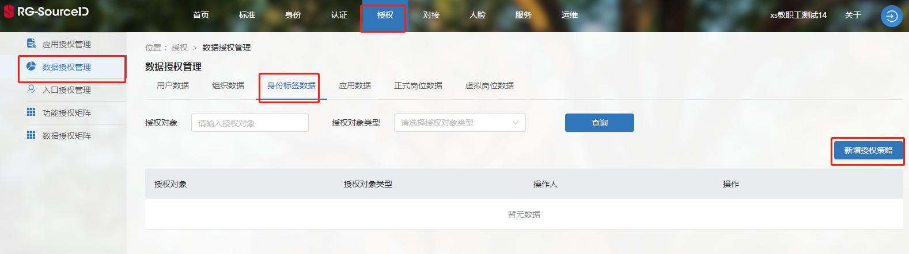
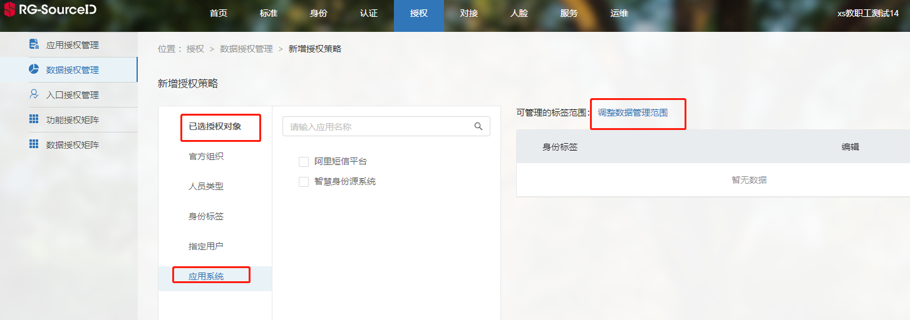

# 开发前须知

>[标签接口规范说明](#link1)
>
>[标签接口调用授权](#link2)
>
>[标签数据获取授权](#link3)

#### 标签接口规范说明：

1. 各类数据内容返回， 属性名为驼峰式， 以文档示例为准

2. 分页接口， 分页参数属性是驼峰式， 以文档示例为准

   

#### 标签接口调用授权：

* [获取accessToken](../../../get-access-token.md)
* 设置请求头 Authorization: Bearer {access_token}

#### 标签数据授权：

