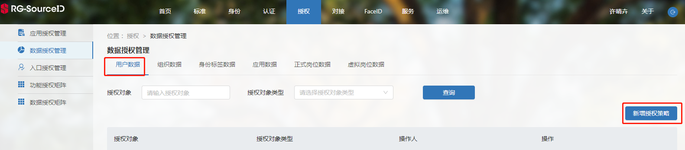
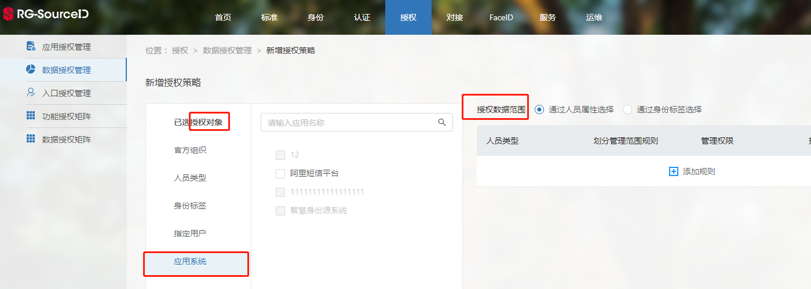

# 开发前须知

>[用户接口规范说明](#link1)
>
>[用户接口调用授权](#link2)
>
>[用户数据获取授权](#link3)

#### 用户接口规范说明：

1. 用户信息返回， 以国标为准， 属性名返回为大写， 文档示例仅为参考， 属性可随配置增减

2. 分页接口， 分页参数属性是驼峰式， 以文档示例为准

3. 分页接口， 数据内容部分，属性名返回为大写， 文档示例仅为参考， 属性可随配置增减

#### 用户接口调用授权：

* [获取accessToken](/get-access-token.html)
* 设置请求头 Authorization: Bearer {access_token}

#### 用户数据授权：

