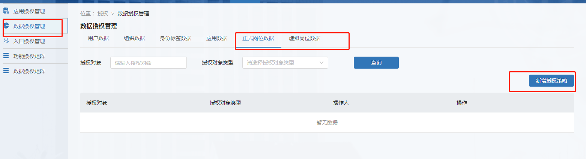
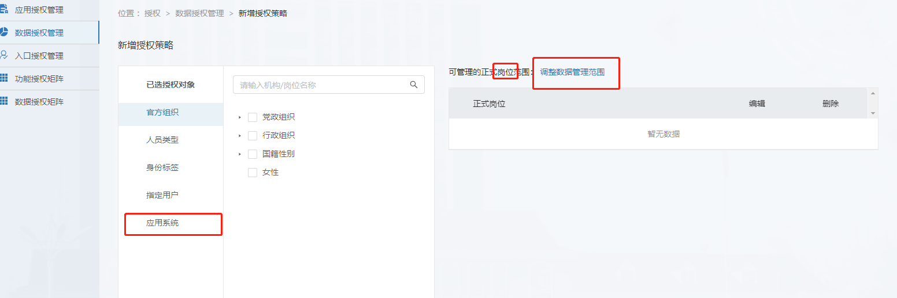

# 开发前须知

>[三元组接口规范说明](#1)
>
>[三元组接口调用授权](#2)
>
>[组织数据授权](#3)
>
>[用户数据授权](#4)
>
>[标签数据授权](#5)
>
>[岗位数据授权](#6)

#### 角色接口规范说明：

1. 各类数据内容返回， 属性名为驼峰式， 以文档示例为准

2. 分页接口， 分页参数属性是驼峰式， 以文档示例为准

   

#### 角色接口调用授权：

* [获取accessToken](../../../get-access-token.md)
* 设置请求头 Authorization: Bearer {access_token}

#### 组织数据授权

[组织数据授权](../../organization/introduction/README.md)

#### 用户数据授权

[用户数据授权](../../user/introduction/README.md)

#### 标签数据授权

[标签数据授权](../../label/introduction/README.md)

#### 岗位数据授权

