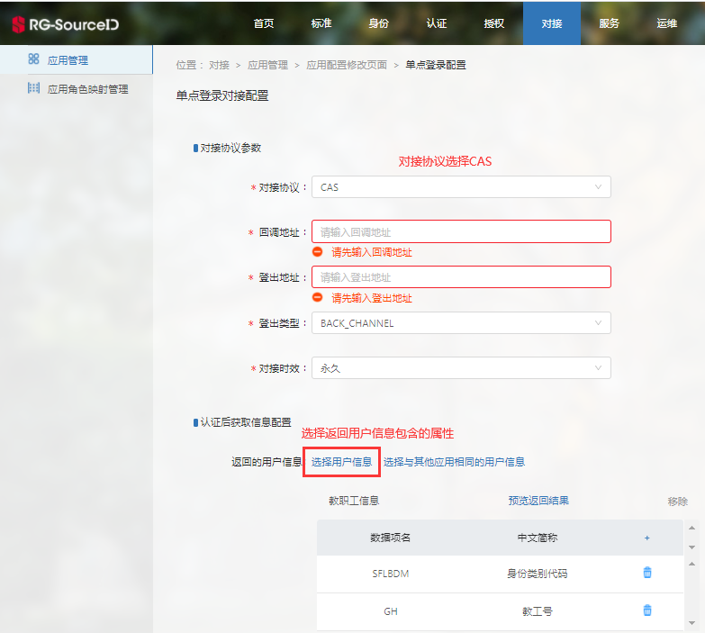
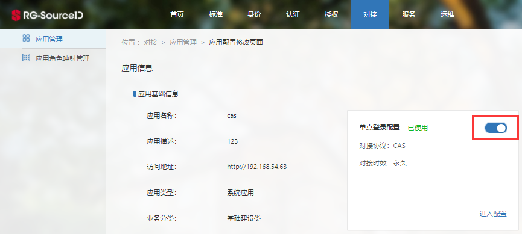

# 统一认证对接

>[CAS认证应用配置](#1)
>
>[OAuth认证应用配置](#2)

应用若要进行SID认证，包括CAS和OAuth认证两种方式，需先在SID中注册应用，配置单点登录对接信息。

#### CAS认证应用配置

1.[应用注册](/application-register.html)。

2.单点登录对接配置-进入配置。

3.配置CAS单点登录对接相关信息。

注：

（1）回调地址采用地址匹配模式，可匹配该地址的子集地址。

4.启用配置。

#### OAuth认证应用配置

1.[应用注册](/application-register.html)。

2.单点登录对接配置-进入配置。

3.配置OAuth2单点登录对接相关信息。

注：

（1）回调地址采用地址匹配模式，可匹配该地址的子集地址。

（2）记录下应用ID、应用秘钥，供应用请求SID认证接口时使用。

4.启用配置。

